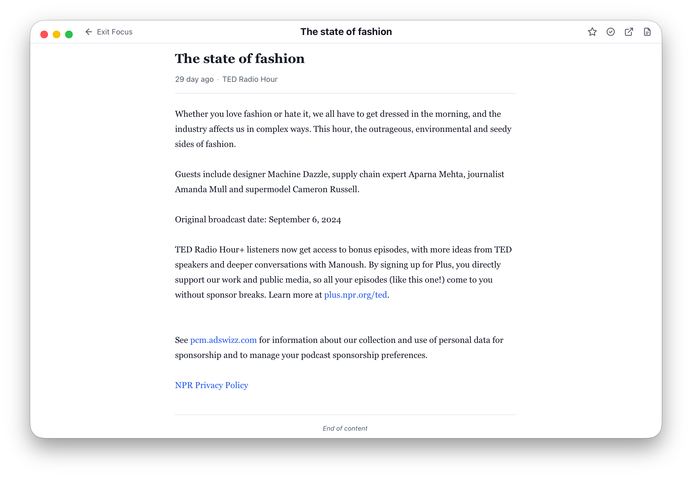

<div align="center">


# Clip

**简单好用的跨平台 RSS 阅读器** —— 支持 macOS / Windows，专注于快速浏览与阅读。

      

简体中文 | [繁體中文](README.zh-TW.md) | [English](README.md)

</div>

## 截图

<div align="center">




</div>

## 主要功能

- **三栏布局**：左侧源/文件夹树 · 中间文章列表 · 右侧阅读视图
- **订阅管理**：添加订阅源、分类整理、OPML 导入导出
- **定时抓取**：RSS / Atom 解析，后台定时自动刷新
- **专注阅读**：全文阅读视图 + 无干扰专注模式
- **快速检索**：覆盖标题、摘要与笔记的全局全文搜索
- **笔记记录**：为文章添加笔记，随时回顾
- **桌面通知**：新文章到达提醒，支持 macOS Dock / Windows 任务栏角标
- **键盘驱动**：完善的快捷键系统
- **主题与国际化**：浅色 / 深色 / 跟随系统，支持多语言
- **性能与离线**：轻量列表查询、本地缓存、离线可读

## 从源码构建

### 1. 准备开发环境

| 依赖 | 版本要求 | 安装方式 |
|:-----|:---------|:---------|
| Go | ≥ 1.25 | https://go.dev/dl/ |
| Node.js | ≥ 20 | https://nodejs.org/ |
| pnpm | ≥ 9 | `npm install -g pnpm` |
| Wails v3 CLI | latest | `go install github.com/wailsapp/wails/v3/cmd/wails3@latest` |

平台额外要求：

- **macOS**：安装 Xcode Command Line Tools —— `xcode-select --install`
- **Windows**：确保已安装 WebView2 Runtime（Windows 11 预装）

### 2. 克隆并安装依赖

```bash
# 克隆仓库
git clone https://github.com/clip-rss/clip.git
cd clip

# 安装前端依赖
cd frontend
pnpm install
cd ..

# 拉取 Go 依赖
go mod tidy
```

### 3. 开发模式（热重载）

```bash
wails3 task dev
```

> 启动 Vite 开发服务器与 Go 后端，改代码实时生效。

### 4. 编译与打包

```bash
# 编译当前平台二进制
wails3 task build

# 打包为可分发的安装包（macOS 生成 .app / Windows 生成安装程序）
wails3 task package
```

产物输出到 `bin/` 目录。

### 5. 测试

```bash
# Go 后端测试
go test ./...

# 前端类型检查 + 单元测试
cd frontend
pnpm typecheck
pnpm test
```

### 补充：同步前端绑定

修改 `api/` 下暴露给前端的绑定方法或 Go 模型后，需重新生成前端 TS 绑定：

```bash
wails3 generate bindings
```

不要手动修改 `frontend/bindings/` 下的文件。

## LICENSE

[MIT](LICENSE)
